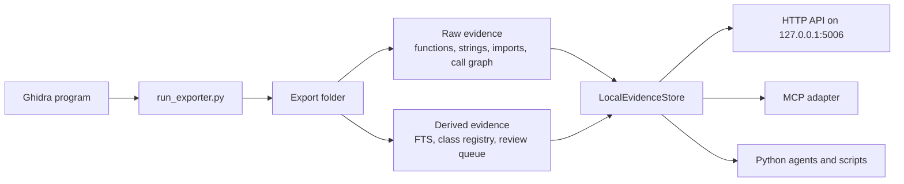

# RE-Evidence-Hub

RE-Evidence-Hub turns an opened Ghidra program into a portable evidence
folder that humans, scripts, and AI tools can query without keeping Ghidra
open.

It is useful when a binary is too large to understand function by function in
Ghidra. The exporter saves the things you normally inspect manually:
decompiler output, assembly, callers, callees, strings, imports, globals,
types, memory layout, and a call graph. Host-side tools then search that
evidence, build derived indexes, generate reports, and expose a local API for
interactive investigation.

The project is evidence-first. It helps you find and review facts; it does not
pretend generated names or model guesses are ground truth.

## What Problem It Solves

Large reverse-engineering projects have three recurring problems:

- Ghidra is the source of truth, but live Ghidra queries are slow and awkward
  for broad search.
- AI tools need bounded, address-stable evidence instead of huge pasted
  decompiler dumps.
- Function names discovered during analysis should be reviewable and
  reversible instead of immediately mutating the Ghidra database.

This project solves that by splitting work into two phases:

1. **Export once from Ghidra.** Save a structured snapshot of the program.
2. **Investigate locally.** Use Python tools, HTTP/MCP APIs, reports, and
   optional AI helpers against that snapshot.

## Mental Model



Exports are kept under `project_exports/<program-name>/` by default. The raw
export is the durable record. Derived files can be rebuilt. Accepted
function-name annotations live in `<export>\annotations\` and can be deleted
without changing raw Ghidra output.

## Quick Start

1. Open and analyse a program in Ghidra.
2. Run [run_exporter.py](run_exporter.py) from Ghidra's Script Manager.
3. Validate the export:

```powershell
python .\tools\validate_export.py .\project_exports\sample_program.exe --full
```

4. Start the local evidence API:

```powershell
python .\binary_agent_server.py --export .\project_exports\sample_program.exe
```

5. Check the server and search:

```powershell
Invoke-RestMethod http://127.0.0.1:5006/health
Invoke-RestMethod http://127.0.0.1:5006/search -Method Post -ContentType application/json -Body '{"query":"sendto","limit":5}'
```

6. Inspect one candidate:

```powershell
Invoke-RestMethod http://127.0.0.1:5006/lookup -Method Post -ContentType application/json -Body '{"address":"00401000","include_decompiler":true}'
```

For a fuller walkthrough, read [Getting started](docs/getting-started.md).

## Install as a CLI (`revhub`)

The host tools also install as a single `revhub` command:

```powershell
python -m pip install -e .
```

That adds console commands backed by the same code (`revhub`, plus
`revhub-doctor`, `revhub-serve`, `revhub-mcp`, `revhub-query`):

| Command | Does |
| --- | --- |
| `revhub doctor` | Preflight: Python, baseline deps, headless prerequisites, and the active export. |
| `revhub use <export>` | Remember an export as the default so you can drop `--export`. |
| `revhub projects` | List complete repo-local project exports and the active one. |
| `revhub query <cmd>` | Query the active export (same as `tools/evidence_tools.py`). |
| `revhub serve` / `revhub mcp` | Start the HTTP API / stdio MCP adapter. |
| `revhub validate` | Validate the active export. |
| `revhub index` / `classes` / `review-queue` | Build derived indexes for the active export. |
| `revhub network` | Build the static networking reconstruction evidence pack. |
| `revhub network-capture <file>` | Import authorised runtime frames from JSON/JSONL/CSV. |
| `revhub protocol-contract` | Create or validate a reviewed reconstruction contract. |
| `revhub overnight --model <model>` | Run a bounded/resumable local-model naming pass. |
| `revhub semantic-index` | Build the optional portable per-export semantic index. |
| `revhub benchmark` | Measure supported store/search latency on the active export. |
| `revhub post-process` | Rebuild AI context, summaries, Markdown, and the search index without reopening Ghidra. |

**Current export pointer.** `revhub use <export>` saves a pointer so every
command defaults to that export instead of repeating a long `--export` path:

```powershell
revhub projects
revhub use sample_program.exe    # project name or an explicit export path
revhub query status            # no --export needed
revhub query lookup 00401000
revhub use --clear             # forget it
```

Resolution order is: an explicit `--export` > the `GHIDRA_AI_EXPORT_PATH`
environment variable > the saved pointer > the built-in default. The pointer
also applies to the positional-path tools (`revhub validate`, `revhub index`,
…): they receive the active export when you do not pass one.

**Preflight.** `revhub doctor` reports what is and is not ready — missing
baseline dependencies as failures, headless prerequisites (JDK 21, Ghidra,
PyGhidra) as warnings — and confirms the active export is valid:

```powershell
revhub doctor
revhub doctor --json     # machine-readable
```

## Main Workflows

| Goal | Use |
| --- | --- |
| Create a portable dataset from Ghidra | `run_exporter.py` in Ghidra |
| Create a dataset without opening Ghidra | `python tools/headless_export.py --binary <exe>` |
| Check that an export is structurally valid | `python tools/validate_export.py <export> --full` |
| Search and inspect evidence interactively | `binary_agent_server.py` on `127.0.0.1:5006` |
| Query evidence from a shell without starting a server | `python tools/evidence_tools.py <command>` |
| Give an MCP-capable AI client local binary tools | `binary_agent_mcp_server.py --export <export>` |
| Use evidence tools inside Python without HTTP | `tools/evidence_tools.py` |
| Record reviewed names without changing raw exports | `tools/function_annotations.py` |
| Build fast decompiler-body search | `tools/build_local_index.py <export>` |
| Build class/vtable review context | `tools/build_class_registry.py <export>` |
| Build low-confidence naming prompts | `tools/build_name_review_queue.py <export>` |
| Generate broad deterministic reports | `tools/start_investigation.py <export>` |
| Map networking lifecycle and reconstruction gaps | `revhub network` |
| Stage disposable overnight naming candidates | `revhub mcp --run-id <run-id>` |
| Run the local model without a separate MCP orchestrator | `revhub overnight --model <model> --run-id <run-id>` |
| Import runtime frames and create a reviewed protocol contract | `revhub network-capture <file>` then `revhub protocol-contract` |

## Important Concepts

**Export folder**

The folder produced by Ghidra. It contains raw JSON such as `manifest.json`,
`functions\<address>.json`, `strings.json`, `imports.json`, `globals.json`,
`callgraph.json`, and `index.json`.

**Raw name**

The function name Ghidra had when the export was created, often `FUN_...`.
Raw names are identifiers, not conclusions.

**Accepted annotation**

A reviewed name stored in `annotations\function_names.json` with evidence,
confidence, and the exported assembly hash. Accepted annotations appear as
`active_name` in local evidence queries.

**Derived index**

A rebuildable helper file created from raw evidence, such as
`local_evidence.sqlite3`, `class_registry.json`, or
`name_review_queue.json`.

**Evidence lead**

A search hit, string reference, semantic result, packet candidate, or review
queue proposal. Leads are useful starting points, but they are not confirmed
behavior until the underlying function/data flow is inspected.

## Local Evidence API

The HTTP API is the normal manual interface after an export exists. It reads
raw export files plus accepted annotations. It does not require Ghidra,
embeddings, Chroma, or an LLM for core routes.

```powershell
revhub serve --port 5006
```

Useful routes:

- `GET /health`: small liveness check.
- `GET /status`: target identity, function count, annotation count, and index
  availability.
- `GET /routes`: route catalog.
- `POST /search`: find candidate functions.
- `POST /lookup`: inspect one evidence bundle.
- `POST /asset`, `/control`, `/packet`: trace static evidence leads.
- `POST /class`: query the derived class/vtable registry.
- `POST /review`: query non-promoting name review candidates.
- `POST /reload`: reload accepted annotations after editing them.

See [Local evidence API](docs/local-evidence-api.md) for examples.

## Direct Evidence CLI

For one-off shell queries where you do not want to start the HTTP server, use
the in-process evidence CLI:

```powershell
revhub query status
revhub query search sendto --limit 5
revhub query lookup 0047c870 --no-decompiler --assembly
```

It uses the same `LocalEvidenceStore` core as HTTP/MCP and prints JSON.

## AI Usage

AI should use this project as an evidence retriever, not as an oracle.

- For in-process Python agents, use [tools/evidence_tools.py](tools/evidence_tools.py).
- For external tools, use the HTTP API or
  [binary_agent_mcp_server.py](binary_agent_mcp_server.py).
- Treat `/semantic`, `/hybrid`, `/ask`, vector search, and model output as
  leads only.
- Record confirmed names with [function annotations](docs/function-annotations.md)
  so later sessions do not need to rediscover them.
- For unattended, resumable runs (an MCP client naming functions overnight), see
  [Autonomous investigation over MCP](docs/autonomous-agent.md): the MCP server's
  `binary_next_target` / `binary_propose_name` / `binary_progress` tools stage
  disposable candidates under one run id. A stronger reviewer later uses
  `binary_review_candidate`; unattended output is never active automatically.

## Project Layout

| Path | Role |
| --- | --- |
| `run_exporter.py`, `AIExporter.py`, `pipeline.py` | Ghidra Script Manager entry point and export orchestration. |
| `tools/headless_export.py` | Run the same export without the Ghidra GUI, via PyGhidra. |
| `exporters/` | Export modules for memory, imports, types, globals, strings, functions, call graph, index, and summaries. |
| `util/` | Ghidra-side helpers for decompilation, filesystem handling, and JSON writing. |
| `binary_agent_server.py` | Flask HTTP adapter over the local evidence store. |
| `binary_agent_mcp_server.py` | Dependency-light stdio MCP adapter over the same evidence store. |
| `tools/local_evidence.py` | Core read-only query engine for one export. |
| `project_exports/` | Ignored, repo-local per-project workspaces (configurable with `RE_EVIDENCE_PROJECTS_ROOT`). |
| `tools/network_reconstruction.py` | Deterministic static networking evidence pack and gap checklist. |
| `tools/naming_candidates.py` | Isolated model proposals and explicit review/promotion. |
| `tools/autonomous_naming_runner.py` | Budgeted OpenAI-compatible/Ollama local-model runner. |
| `tools/network_capture.py`, `tools/protocol_contract.py` | Runtime observations and reviewed recreation contracts. |
| `tools/semantic_index.py` | The single optional portable semantic backend. |
| `tools/evidence_tools.py` | In-process AI/script adapter and CLI over `LocalEvidenceStore`. |
| `tools/evidence_client.py` | Small HTTP client for the running API. |
| `tools/` | The supported evidence surface: validation, derived indexes, reports, annotations, and the read-only query core. |
| `experimental/` | Unsupported semantic/vector/LLM/agent helpers and older duplicates (leads only). See [experimental/README.md](experimental/README.md). |
| `docs/` | Workflow, API, and architecture notes. |


## Development Notes

- Ghidra-side code and host-side Python run in different environments. Keep
  host-only dependencies out of `exporters/` and `util/`.
- Install the supported baseline with `python -m pip install -r requirements-core.txt`
  (just `flask`, `requests`, `numpy`). For an exact, reproducible install use
  `requirements.lock`. The optional semantic/vector stack lives in
  `requirements-optional.txt` and is not needed for the evidence workflow.
  `requirements.txt` still installs everything for backward compatibility.
- Run tests with:

```powershell
python -m unittest discover -s tests
```

- The state of supported vs experimental host tools is tracked in
  [Current development state](docs/current-state.md).

## Documentation map

- [Getting started](docs/getting-started.md): first export through first query.
- [Projects and exports](docs/projects-and-exports.md): layout, selection, backup, and relocation.
- [Networking reconstruction](docs/network-reconstruction.md): static evidence pack and recreation workflow.
- [Optional semantic search](docs/semantic-search.md): the single portable vector backend.
- [Artifact schemas](docs/artifact-schemas.md): locking, audit, backup, and migrations.
- [AI agent guide](docs/ai-agent-guide.md): evidence rules and bounded tool usage.
- [Overnight naming](docs/autonomous-agent.md): isolated local-model pass and later review.
- [Architecture](docs/architecture.md): runtime boundaries and data contracts.
- [Audit and roadmap](docs/project-audit-and-roadmap.md): findings, completed improvements, and backlog.
